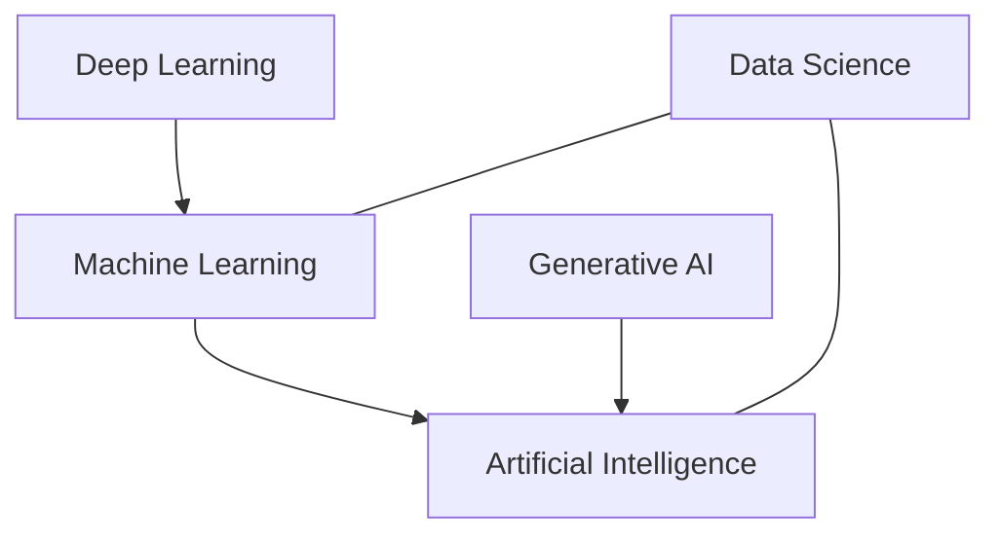
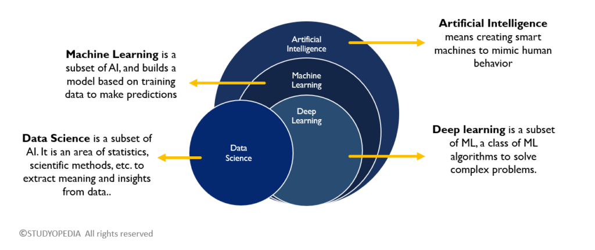

# Day 1 — The AI Landscape (AI, ML, DL, GenAI, Data Science)

Today’s goal: build a clear mental model of how Artificial Intelligence (AI), Machine Learning (ML), Deep Learning (DL), Generative AI (GenAI), and Data Science relate, what they mean, and where they’re used in real life.

## Quick Definitions

- AI (Artificial Intelligence): The broad field focused on creating systems that can perform tasks that normally require human intelligence (reasoning, perception, decision-making, language understanding).

- ML (Machine Learning): A subfield of AI where systems learn patterns from data to make predictions or decisions without being explicitly programmed for every rule.

- DL (Deep Learning): A subfield of ML that uses deep neural networks (many layers) to learn high-level representations from large amounts of data (images, audio, text, etc.).

- GenAI (Generative AI): AI models (often deep learning-based) that generate new content—text, images, audio, code—based on patterns learned from data.

## Applications (What They’re Used For)

- AI:
	- Planning and decision support, knowledge reasoning, search, rule-based systems.
	- Robotics: navigation, manipulation, perception.
	- Conversational agents, recommendation, personalization.

- ML:
	- Forecasting (sales, demand, energy), anomaly detection (fraud, security), recommendations.
	- Classification and regression across domains (healthcare, finance, marketing).
	- Optimization of operations and A/B testing.

- DL:
	- Computer vision (object detection, medical imaging), speech (ASR/TTS), NLP (classification, Q&A).
	- Multimodal learning (image+text), time-series with complex patterns.
	- Edge AI (on-device vision), autonomous systems.

- GenAI:
	- Text generation (summaries, chat, drafting), code generation.
	- Image generation (concept art, product mockups), video/audio synthesis.
	- Data augmentation, synthetic data, creativity support tools.

## Real-Life Examples (Concrete)

- AI: Route planning in maps; intelligent email spam filtering; chess/go engines.
- ML: Credit risk scoring; churn prediction for subscriptions; product recommendations.
- DL: Face unlock on phones; voice assistants’ speech recognition; medical image triage.
- GenAI: Chatbots drafting emails; creating marketing images; generating boilerplate code/tests.

## How They Relate (At a Glance)

- ML ⊂ AI (ML is a subset of AI).
- DL ⊂ ML (DL is a subset of ML).
- GenAI is a capability area within AI (often powered by DL).
- Data Science overlaps with AI/ML (data pipelines, analysis, modeling, storytelling), but is not strictly a subset of AI.

### Relationship Diagram (Mermaid)

### Relationship Image 

---

## Data Science: Definition and Relation to AI/ML/DL/GenAI

**Data Science** is the end-to-end discipline of extracting value from data—covering data collection, cleaning, exploration (EDA), feature engineering, modeling (often ML/DL), evaluation, and communicating insights through storytelling and visualization. It combines statistics, programming, business understanding, and machine learning.

How Data Science relates:
- With AI: Data Science provides the data pipelines, analysis, and evaluation that inform AI systems’ behavior and impact.
- With ML: Many DS projects include ML models (classification, regression, clustering) embedded in a broader workflow.
- With DL: DS sometimes uses DL for unstructured data (images, text, audio) when complexity or scale demands it.
- With GenAI: DS can leverage GenAI for text analytics, code acceleration, data augmentation, and automated documentation.

Typical Data Science workflow:
1) Problem framing + metrics
2) Data sourcing + cleaning
3) EDA + hypothesis testing
4) Feature engineering + model training (ML/DL as needed)
5) Validation, bias/variance checks, and error analysis
6) Deployment (if required) + monitoring + iteration
7) Communication: reports, dashboards, and stakeholder alignment

Real-world DS examples:
- Demand forecasting and inventory optimization.
- Customer segmentation and lifetime value modeling.
- Pricing optimization and A/B experimentation.
- Marketing attribution and uplift modeling.
- Operations analytics dashboards for decision-makers.

---

## Summary (Day 1)

- AI is the broad goal; ML is a data-driven approach within AI; DL is a powerful ML technique; GenAI focuses on generating new content.
- Data Science is the practical, end-to-end discipline that often uses ML/DL/GenAI as tools within pipelines to solve real problems and communicate insights.

