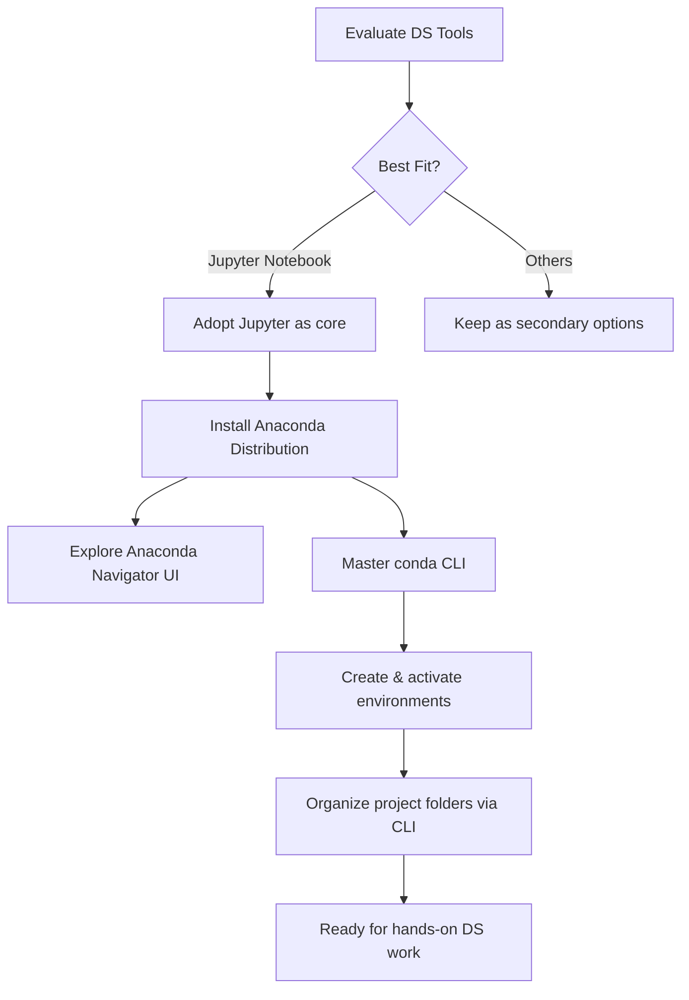

# Day 2 — Building the Data Science Toolkit 🧰

Day 2 focused on exploring the ecosystem of tools that support a practical Data Science workflow. I compared popular IDEs/notebooks, locked in on Jupyter Notebook as my primary environment, and installed the Anaconda Distribution to manage environments, packages, and project structures from the command line.

— Last updated: 17 December 2025

## Learning Objectives
- 🧭 Map the most common Data Science IDEs/notebooks and understand their strengths.
- ✅ Decide on a primary tool (Jupyter Notebook) for this 6-month journey.
- 📦 Install Anaconda, explore Anaconda Navigator, and master the `conda` CLI.
- 🗂️ Practice creating environments, folders, and project scaffolds via the terminal.

## Tooling Explorer (What I Evaluated)

| Icon | Tool | Core Use Case | Key Notes |
| --- | --- | --- | --- |
| 🧪 | Jupyter Notebook | Interactive notebooks for experiments, visuals, documentation. | Browser-based, cell execution, tight integration with Python/Markdown. **Chosen primary tool.** |
| ☁️ | Google Colab | Cloud notebooks with GPUs, collaboration. | Great for quick experiments; requires internet; limited local file control. |
| 🧩 | VS Code | General-purpose code editor with extensions. | Rich plugins, built-in terminals, Jupyter support via extensions. |
| 🧠 | PyCharm | Full IDE optimized for large Python projects. | Robust debugging/testing; heavier footprint; excellent refactoring tools. |
| ⚡ | Cursor | AI-assisted editor for rapid iteration. | Copilot-style suggestions, good for prototyping; still evolving. |
| 🐍 | Spyder | Scientific IDE inspired by MATLAB. | Variable explorer, inline plots; simpler UI, best for pure scientific workflows. |

**Decision:** Jupyter Notebook wins for this challenge due to its interactive flow, Markdown support, visual feedback, and seamless integration with data exploration.

### Comparative Criteria (Snapshot UI)

```md
🧪 Jupyter
├── Strengths: interactive cells, rich visuals, shareable .ipynb
└── Ideal for: experimentation, learning, documentation

☁️ Colab
├── Strengths: free GPU, easy sharing, built-in libraries
└── Ideal for: quick demos, heavy compute without setup

🧩 VS Code
├── Strengths: extensibility, integrated terminals, Git
└── Ideal for: end-to-end projects, multi-language repos

🧠 PyCharm
├── Strengths: refactoring, debugger, profiler
└── Ideal for: production-grade Python apps

⚡ Cursor
├── Strengths: AI pair programming, fast iteration
└── Ideal for: prototyping, code generation

🐍 Spyder
├── Strengths: variable explorer, scientific layout
└── Ideal for: data-heavy scripts, lab-style analysis
```

## Learning Map (Mermaid Diagram)



## Anaconda Ecosystem Deep-Dive

- **Anaconda Distribution:** Bundle of Python, conda package manager, and 250+ scientific libraries (NumPy, Pandas, SciPy, etc.).
- **Anaconda Navigator:** GUI to launch Jupyter, VS Code, Spyder; manage environments visually.
- **conda CLI:** Terminal interface for creating and managing environments, packages, and channels.

### Installing Anaconda (macOS)

1. Download the macOS installer from [anaconda.com](https://www.anaconda.com/download).
2. Run the installer (`.pkg`) and follow prompts (allow PATH updates when asked).
3. Verify installation:

```bash
conda --version
which conda
```

4. (Optional) Initialize conda for your shell:

```bash
conda init zsh
```

### Navigator UI Highlights
- Launch Jupyter Notebook with a single click.
- Review installed environments, switch kernels without touching the CLI.
- Browse popular packages; quick install/updates.

> Tip: Keep Navigator for quick visuals, but rely on the CLI for speed, reproducibility, and automation.

## Conda CLI Crash Course

```bash
# Update conda itself
conda update conda

# Create a fresh environment for daily practice
conda create --name ds-day2 python=3.11 numpy pandas jupyterlab

# Activate / deactivate environments
conda activate ds-day2
conda deactivate

# List all environments
conda env list

# Install packages into the active environment
conda install scikit-learn matplotlib seaborn

# Remove an environment if needed
conda remove --name ds-day2 --all
```

## Organizing Projects via CLI

```bash
# Navigate to the challenge root
cd ~/Desktop/Data-Science-in-6-Months

# Create a notebooks workspace inside Day 2
mkdir -p "1st-Month/Day-2/notebooks"

# Start Jupyter Notebook pointing to the Day-2 folder
jupyter notebook "1st-Month/Day-2"

# Or launch JupyterLab if installed
jupyter lab "1st-Month/Day-2"
```

Recommended project layout:

```
1st-Month/
	Day-2/
		notebooks/
			day-2-tooling.ipynb
		data/
		scripts/
		assets/
		readme.md  ← you are here
```

## Icons & Visual Flair

- Place custom icons or screenshots in: `1st-Month/Day-2/assets/`
- Reference them in Markdown:

```md

```

- Suggested visuals to capture:
	- Navigator home screen with launch buttons.
	- Terminal snapshot of `conda env list`.
	- Jupyter Notebook interface highlighting code + Markdown cells.

## Key Takeaways
- Jupyter Notebook is my primary environment for this challenge, backed by secondary tools as needed.
- Anaconda provides a robust foundation for managing Python versions, packages, and environments.
- Mastery of the `conda` CLI accelerates reproducible setup, while Navigator offers a friendly overview.
- A clean folder structure from Day 2 ensures future months stay organized and scalable.

Next up: start building notebooks inside the new environment to practice core Python and data manipulation skills.

